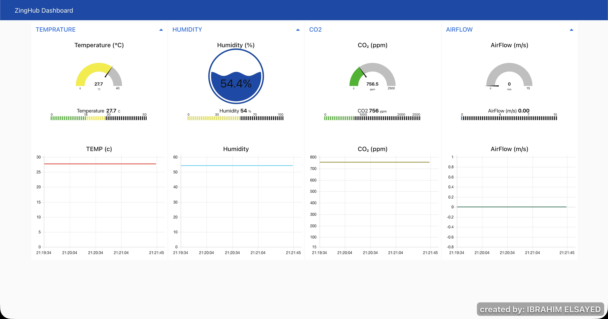
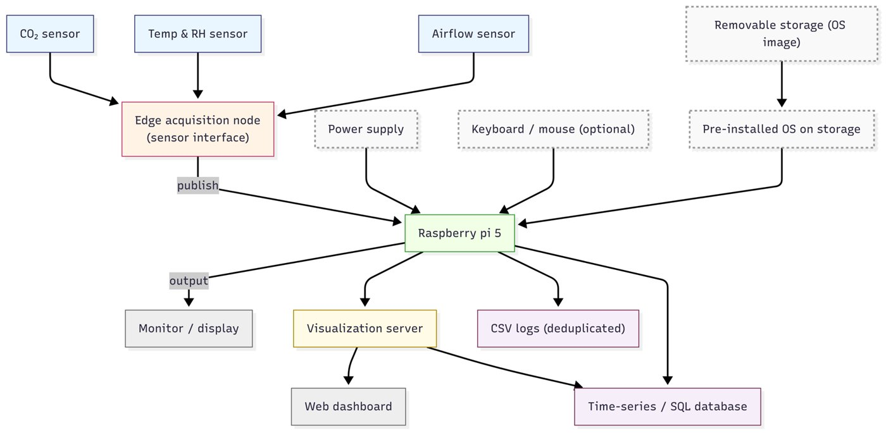
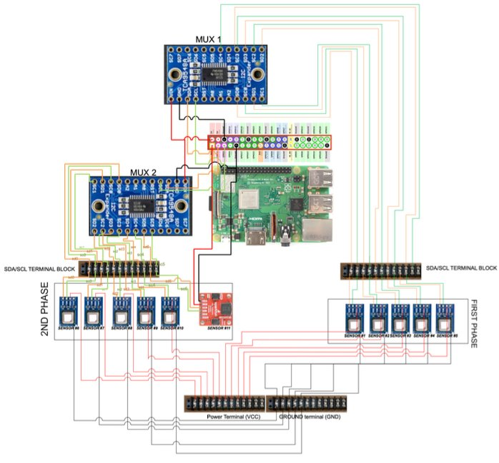
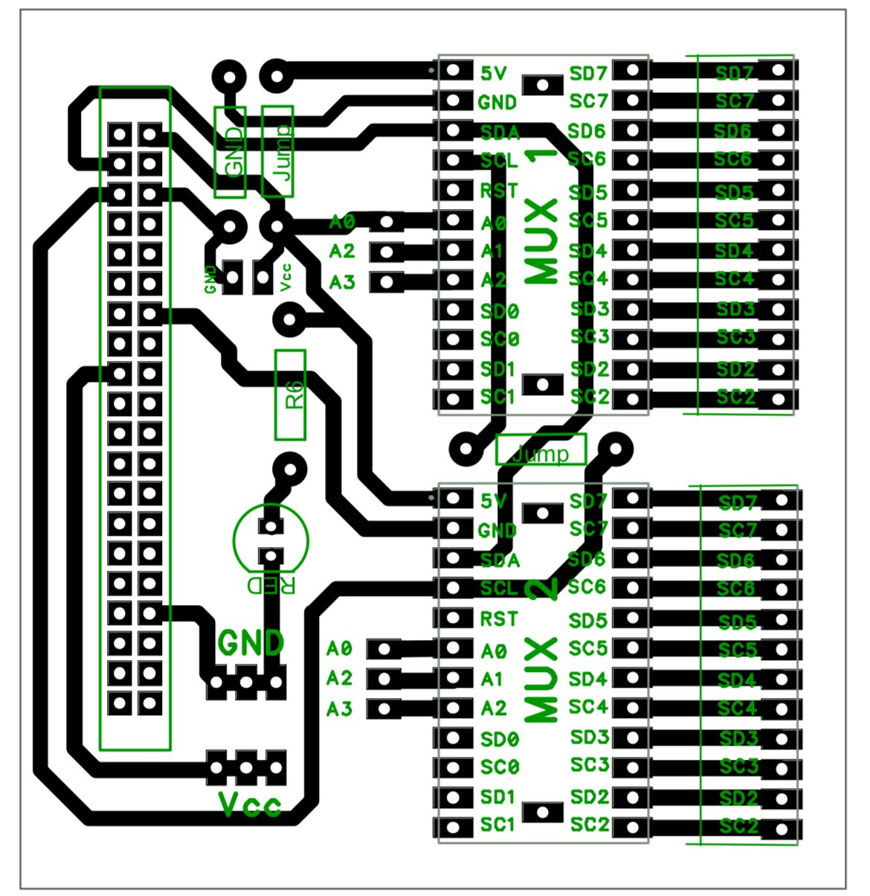
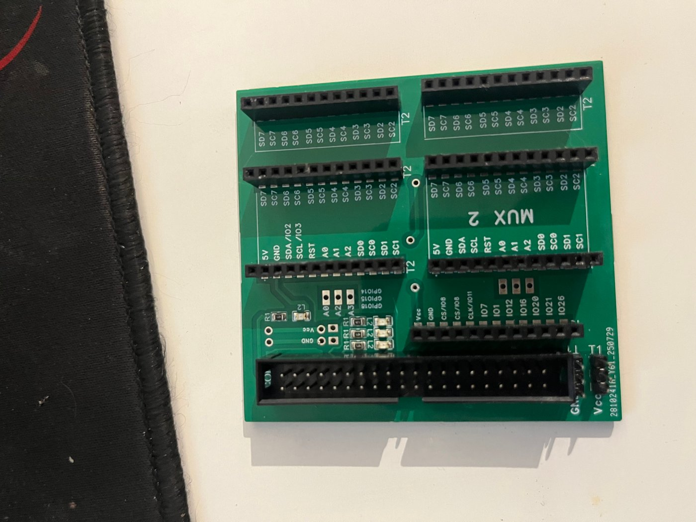
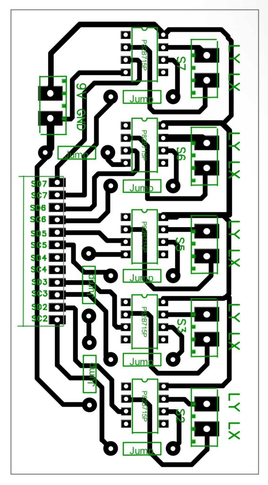
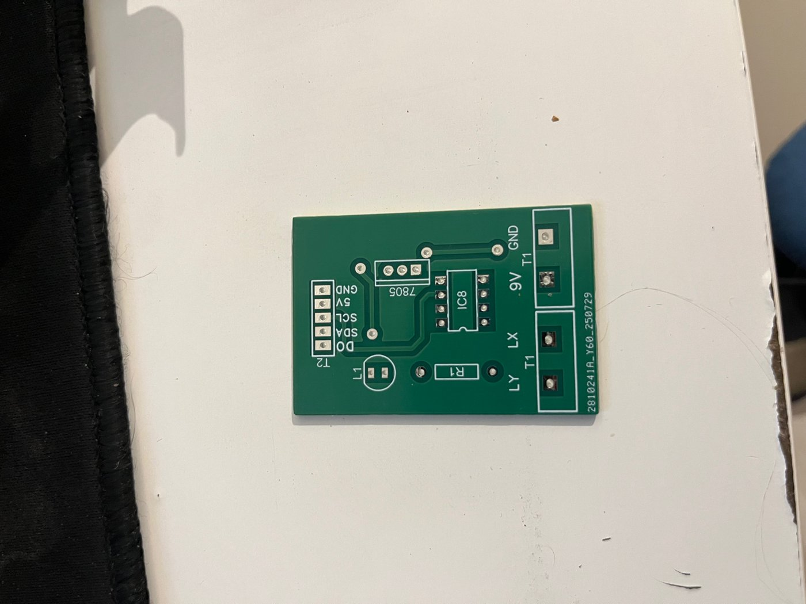
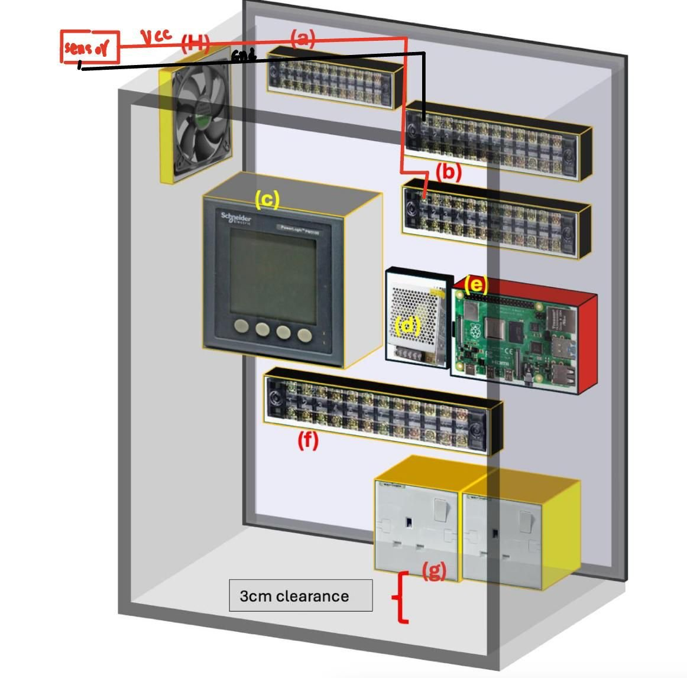
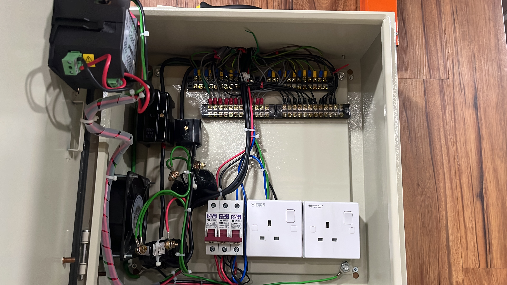

# Indoor Air Quality Monitor

A Raspberry Pi-based multi-node air quality monitoring system with real-time
data logging to MariaDB, rolling CSV export, and a live Node-RED dashboard.
Built as a Final Year Project (Bachelor of Electrical and Electronics
Engineering) at the University of Wollongong in Malaysia — deployed to
continuously monitor the **ZingHub** study space over a 3-day field study.



---

## Key Findings

A 3-day continuous deployment (8:00 AM–6:00 PM) benchmarked ZingHub against
WHO, ASHRAE 55, OSHA, and Malaysia's ICOP IAQ 2010 standards:

| Parameter | Range Measured | Standard | Result |
|---|---|---|---|
| CO₂ | 550–903 ppm | < 1000 ppm (WHO/ASHRAE) | ✅ Within limit, but approached the comfort threshold in late afternoon |
| Temperature | 23.6–31.0 °C | 23–26 °C comfort range | ⚠️ Frequently exceeded, especially Day 1 (>30 °C sustained) |
| Relative Humidity | 46–69% | 40–70% (ICOP) | ✅ Within range, brief morning peaks near 70% |
| Airflow | ~0.69 m/s (steady) | > 0.5 m/s (ICOP) | ✅ Exceeded minimum, aided convective cooling |

**Takeaway:** the space met baseline health/safety thresholds but not comfort
guidelines — elevated afternoon CO₂ and prolonged high temperatures point to
under-provisioned ventilation and cooling, motivating the case for smart IAQ
monitoring paired with adaptive HVAC control.

---

## What It Does

- Reads **CO2, temperature & humidity** from up to 12 SCD41 sensors across
  2 TCA9548A I2C multiplexers (addresses `0x70` and `0x71`)
- Auto-detects an **FS3000 airflow sensor** on any mux channel — no manual
  config needed
- Stores all readings to **MariaDB** using duplicate-safe `INSERT IGNORE`
- Exports **rolling CSV master files** hourly with deduplication checkpointing,
  so no duplicate rows are ever written, even after a restart
- Visualizes live readings on a **Node-RED dashboard** (gauges + trend charts
  for CO₂, temperature, humidity, and airflow)
- Runs continuously with graceful shutdown (Ctrl+C cleans up the I2C bus and
  DB connection)

---

## System Architecture



Sensors → dual I2C multiplexers → Raspberry Pi 5 → MariaDB → Node-RED
dashboard, with hourly CSV export running alongside the live DB writes.

<details>
<summary>Full circuit schematic</summary>



</details>

---

## Hardware

| Component | Quantity |
|---|---|
| Raspberry Pi 5 (4GB) | 1 |
| SCD41 CO2 / Temperature / Humidity sensor | up to 12 |
| TCA9548A I2C multiplexer | 2 |
| FS3000 airflow sensor | 1 |
| P82B715 I2C bus extender | as needed per sensor node |
| 7805 voltage regulator | per sensor node |

**Custom PCBs** were designed and fabricated for the Pi↔multiplexer interface
and the multiplexer↔bus-extender sensor nodes:

<table>
<tr>
<td><br/><sub>Layout — Pi to dual multiplexer</sub></td>
<td><br/><sub>Fabricated board</sub></td>
</tr>
<tr>
<td><br/><sub>Layout — multiplexer to bus extender</sub></td>
<td><br/><sub>Fabricated sensor node</sub></td>
</tr>
</table>

The enclosure (designed for field deployment at ZingHub):



Fully wired and assembled:



The finished, closed box:


A Schneider PowerLogic digital meter (component c) is mounted on the front panel for local power monitoring:


---

## Software Stack

- Python 3
- `adafruit-circuitpython-scd4x` — SCD41 driver
- `adafruit-circuitpython-tca9548a` — I2C mux driver
- `smbus2` — low-level I2C channel switching
- `sparkfun-qwiic-fs3000` — airflow sensor driver
- `mysql-connector-python` — MariaDB interface
- MariaDB (MySQL) — time-series sensor storage
- Node-RED — real-time dashboard
- CSV — rolling backup export

---

## Setup

### 1. Clone the repo

```bash
git clone https://github.com/ibrahimelsayed804/indoor-air-quality-monitor.git
cd indoor-air-quality-monitor
```

### 2. Install dependencies

```bash
pip install -r requirements.txt
```

### 3. Set up the database

```bash
mysql -u root -p < schema.sql
```

### 4. Configure your sensors and credentials

Open `data_collection_final.py` and edit the `USER CONFIG` section:

```python
SCD41_CHANNELS = {
    0x70: [2, 3, 4, 5, 6, 7],   # channels with SCD41 on mux 0x70
    0x71: [2, 3, 4, 5, 6, 7],   # channels with SCD41 on mux 0x71
}
```

**Database credentials:** don't leave real credentials hardcoded in the
script if you fork this — set them via environment variables instead, e.g.:

```python
DB_CONFIG = dict(
    host=os.environ.get("IAQ_DB_HOST", "localhost"),
    user=os.environ.get("IAQ_DB_USER", "root"),
    password=os.environ.get("IAQ_DB_PASSWORD", ""),
    database=os.environ.get("IAQ_DB_NAME", "sensor_db"),
)
```

### 5. Run

```bash
python3 data_collection_final.py
```

---

## Data Output

**MariaDB tables created automatically:**

- `fs3000` — airflow readings (timestamp, air_velocity m/s)
- `scd41_1` through `scd41_N` — one table per detected sensor (timestamp, co2 ppm, temperature °C, humidity %)

**CSV files written to `./` by default:**

- `fs3000_master.csv`
- `scd41_1_master.csv` … `scd41_N_master.csv`

CSV exports happen once on startup and then every hour. Duplicate rows are
prevented by tracking the last exported timestamp per file.

---

## Project Structure

```
indoor-air-quality-monitor/
├── data_collection_final.py   # main data logging script
├── schema.sql                 # MariaDB table definitions
├── dashboard.json             # Node-RED flow export
├── requirements.txt           # Python dependencies
├── scd41_1_sample.csv         # example CSV output
├── Dashboard.jpg              # dashboard preview
├── docs/
│   └── images/                # architecture, schematic, PCB, enclosure photos
└── README.md
```

---

## Author

**Ibrahim Said Hussein Elsayed**
Software Engineer, Systems Integration
[LinkedIn](https://www.linkedin.com/in/ibrahim-said-hussein-elsayed)
